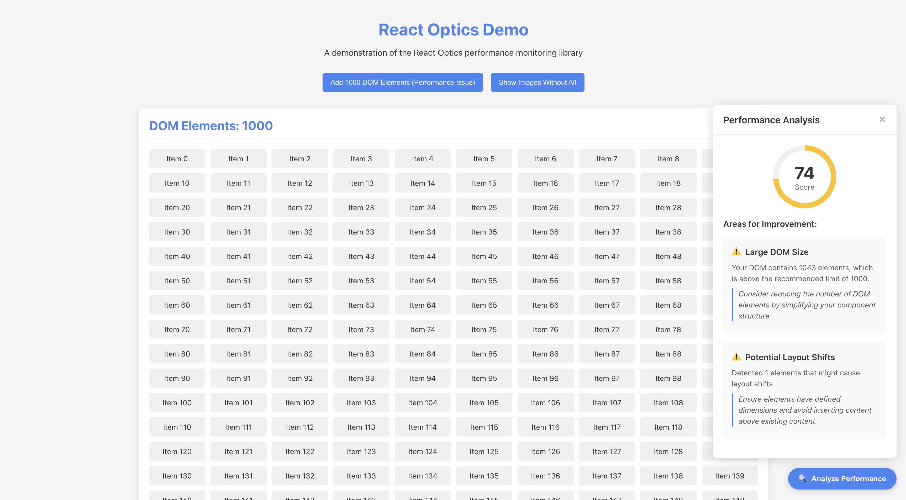

# React Insight

A powerful React performance monitoring component that helps you identify and fix performance issues in your React applications.



## Features

- 🔍 Real-time performance analysis
- 📊 Comprehensive performance metrics
- 🎯 Specific improvement suggestions
- 🚀 Easy integration
- 📱 Responsive design
- 🎨 Customizable UI

## Installation

```bash
npm install react-insight
# or
yarn add react-insight
```

## Quick Start

```jsx
import React from 'react';
import { PerformanceMonitor } from 'react-insight';

function App() {
  return (
    <PerformanceMonitor>
      {/* Your app content */}
      <div>Your React application</div>
    </PerformanceMonitor>
  );
}
```

## Performance Metrics

React Insight monitors several key performance metrics:

- **DOM Size**: Tracks the number of DOM elements and their depth
- **Memory Usage**: Monitors JavaScript heap size
- **Active Timers**: Counts active intervals and timeouts
- **Event Listeners**: Tracks the number of event listeners
- **Interaction Delay**: Measures UI responsiveness
- **Network Requests**: Monitors pending network requests
- **Layout Shifts**: Detects potential layout instability
- **Image Optimization**: Checks for missing alt attributes and large images

## Usage

### Basic Usage

Wrap your application with the `PerformanceMonitor` component:

```jsx
import { PerformanceMonitor } from 'react-insight';

function App() {
  return (
    <PerformanceMonitor>
      <YourApp />
    </PerformanceMonitor>
  );
}
```

### Customization

You can customize the appearance and behavior using CSS modules:

```css
/* Your custom styles */
.container {
  /* Override default styles */
}
```

## Performance Score Calculation

The performance score is calculated based on multiple factors:

- DOM size (elements count and depth)
- Memory usage
- Active timers and event listeners
- Interaction delay
- Network requests
- Layout shifts
- Image optimization

## Contributing

Contributions are welcome! Please feel free to submit a Pull Request.

## License

MIT © Ahmad AlRasheed

## Support

If you find this package helpful, please consider giving it a star on GitHub!
